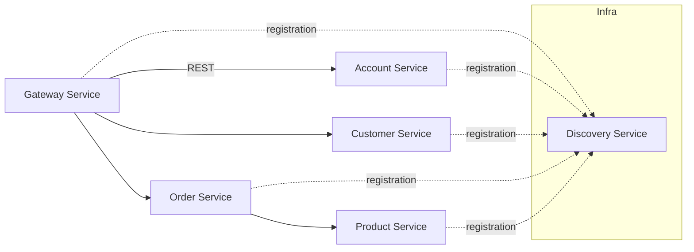

## Mastering Spring Cloud in Testing [](https://twitter.com/piotr_minkowski)

[](https://circleci.com/gh/piomin/sample-spring-cloud-testing)

[](https://sonarcloud.io/dashboard?id=piomin_sample-spring-cloud-testing)
[](https://sonarcloud.io/dashboard?id=piomin_sample-spring-cloud-testing)
[](https://sonarcloud.io/dashboard?id=piomin_sample-spring-cloud-testing)
[](https://sonarcloud.io/dashboard?id=piomin_sample-spring-cloud-testing)

## Overview
This repository implements a microservices architecture using Spring Boot 3.x and Spring Cloud 2025.x, built and managed with Maven. It includes the following services:

- **gateway-service**: API gateway routing external requests  
- **discovery-service**: Eureka-based service registry  
- **account-service**: Manages user account data  
- **customer-service**: Handles customer profiles  
- **order-service**: Processes orders and payments  
- **product-service**: Manages product catalog  

Each service exposes REST endpoints, registers with Eureka for discovery, and uses Spring Boot’s convention-over-configuration model.

## Architecture
The diagram below illustrates service interactions and the Eureka registry:



### Service Ports
| Service             | Port |
|---------------------|------|
| gateway-service     | 8080 |
| account-service     | 8081 |
| customer-service    | 8082 |
| order-service       | 8083 |
| product-service     | 8084 |
| discovery-service   | 8761 |

## Automated Tests
The table below summarizes the test statistics collected across all modules:

| Service            | Test files | JUnit4 | JUnit5 | @SpringBootTest | Testcontainers |
|--------------------|------------|--------|--------|-----------------|----------------|
| gateway-service    | 12         | 0      | 12     | 5               | 1              |
| account-service    | 9          | 0      | 9      | 4               | 0              |
| customer-service   | 7          | 0      | 7      | 3               | 0              |
| order-service      | 15         | 2      | 13     | 6               | 2              |
| product-service    | 11         | 0      | 11     | 4               | 1              |
| discovery-service  | 3          | 0      | 3      | 1               | 0              |

## Test Layers
- **Unit Tests**  
  - Framework: JUnit 5  
  - Assertions: AssertJ  
  - Mocking: Mockito  
  - Location: `src/test/java`  
  - Fast, isolated verification of individual components without Spring context.

- **Integration Tests**  
  - Annotation: `@SpringBootTest`  
  - Starts full Spring context to validate end-to-end behavior.  
  - Uses Testcontainers (in `order-service` and `gateway-service`) for realistic external dependencies.

## Build & Run
Use the Maven wrapper to compile, test, and package all modules:

```bash
./mvnw clean install
```

If you need to start external dependencies for integration tests:

```bash
docker compose -f docker-compose-test.yml up -d   # if docker-compose-test.yml is present
```

To run an individual service in development mode:

```bash
./mvnw -pl gateway-service spring-boot:run
```

## Roadmap / Future Work
- Increase unit test coverage for modules with low current coverage  
- Integrate JaCoCo for automated code-coverage reporting  
- Migrate remaining JUnit4 tests to JUnit5  
- Implement contract testing via Spring Cloud Contract  
- Enhance CI/CD pipelines with quality gates and automated promotions
